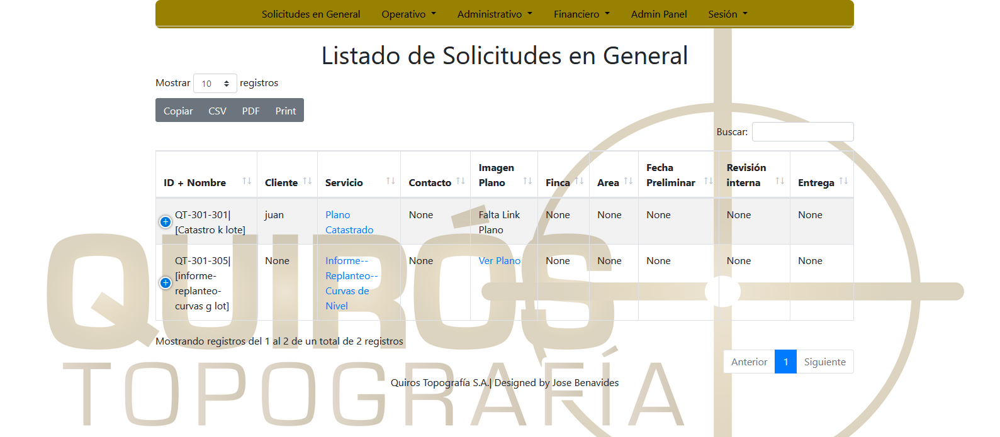
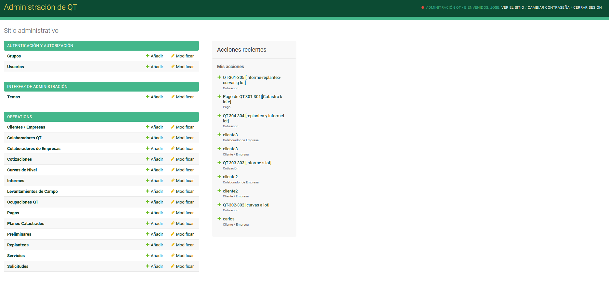

# Personal project to manage the task of a company

From this app you can be in control from the time a quote is requested until the product is delivered.

The database is composed of those who make up the company, customers, service requests, activities required to deliver the product and the assignment of such activity to someone in the company.

It will be possible to observe the states of the collections, states of the activities to control the delays. In short, the idea of this project is to be able to manage everything related to the company so it also has an administration page.

## Used technologies: Python, Django, Heroku database, pillow, gunicorn, beautifulSoup4.

## You can see the app in this link:
Use user: `guest`, password: `12test34`.
https://qtopo.herokuapp.com/

### General Screen

### Admin Panel

